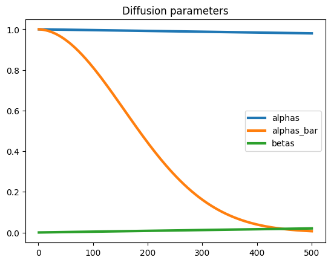
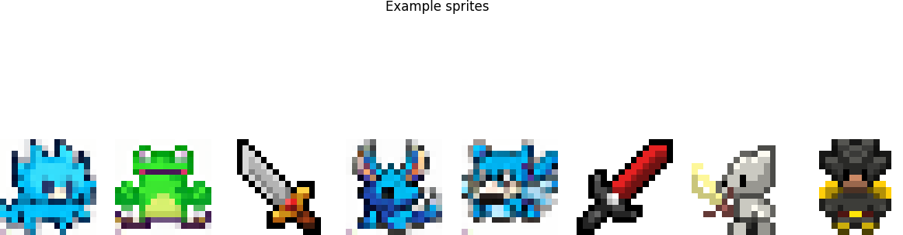
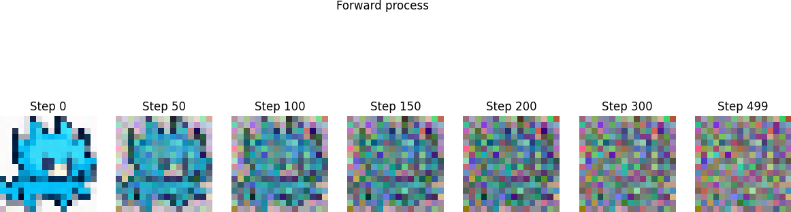
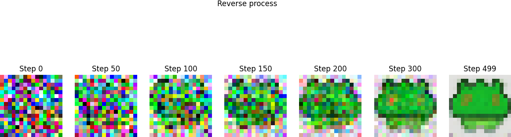

# Exercise 2.1 - Weekly Report

## Summary
This exercise implements and visualizes the Denoising Diffusion Probabilistic Model (DDPM) for image generation using a sprites dataset. The workflow includes forward diffusion (adding noise), reverse process (denoising), and model training. The code is modular, using configuration files for reproducibility.

## Key Questions & Answers
- Q1: What is the purpose of the DDPM model?
  - A1: DDPM is used for generating images by iteratively adding and removing noise, learning the reverse process via a neural network (UNet).
- Q2: How is the diffusion process visualized?
  - A2: The forward process is visualized by adding noise to images at various timesteps; the reverse process shows denoising using a pre-trained model.
- Q3: What are the main challenges?
  - A3: Ensuring correct device placement for tensors, managing paths for assets and models, and implementing the diffusion equations accurately.

## Code Insights

### Visual Results
#### Diffusion Parameters

#### Example Sprites

#### Forward Process

#### Reverse Process

---
Main algorithms: Forward diffusion (q_sample), reverse process (p_sample_loop), and UNet architecture for noise prediction.
Results: Example sprites and diffusion parameters are visualized; model checkpoints and generated samples are saved.
Challenges: Device mismatches (CPU/GPU), absolute path handling, and reproducible training via config files.
